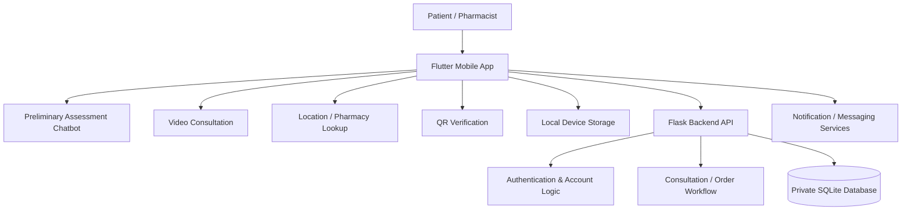

# Telepharmacy Mobile PoC

A cross-platform telepharmacy proof-of-concept developed during the COVID-19 period to explore how patients could access pharmacist consultations remotely through their own mobile devices.

> **Portfolio case study only.** The original application source code, client data, credentials, and environment-specific configuration are intentionally not published in this repository.

## Project at a glance

- **Period:** Apr 2021 – Sep 2022
- **Role:** Co-Principal Investigator and sole developer of the core prototype
- **Context:** Funded applied R&D project developed with an industry pharmacy partner under NTUC FairPrice Co-operative Ltd.
- **Stage:** Prototype / Proof of Concept
- **Outcome:** Technology Readiness Level progressed from TRL 3 to TRL 5
- **Platforms:** Android and iOS from a shared Flutter codebase

## The problem

During COVID-19, conventional pharmacy workflows could require patients to visit a physical location before accessing a remote pharmacist. The project explored a mobile-first alternative: bringing the pharmacist consultation experience to the patient instead.

The prototype was designed around three goals:

1. Improve access to pharmacist advice without requiring the patient to be physically present at a pharmacy.
2. Support a guided remote-consultation workflow, from preliminary assessment through pharmacist consultation and verification.
3. Demonstrate how an existing static telepharmacy setup could be redesigned as a mobile, on-demand digital service.

## What I built

I designed and implemented the core end-to-end prototype, including the Flutter mobile client, Python/Flask backend, data model, authentication workflow, and system integration.

Implemented capabilities included:

- Cross-platform mobile application for Android and iOS
- One-time patient registration with selected data stored locally on the device
- Patient and pharmacist login
- Chatbot-based preliminary assessment
- Notification/messaging of assessment information
- Real-time video consultation
- GPS/location support for nearby pharmacy pickup
- QR-code generation for verification steps
- Consultation/order workflow support
- Local/private backend database for account and order data
- Consultation-video storage on the host device

## High-level architecture

See [Architecture & System Design](docs/architecture.md) for more detail.

## Technology used

| Area | Technology |
| --- | --- |
| Mobile | Flutter / Dart |
| Backend | Python / Flask |
| Database | SQLite |
| Chatbot integration | Dialogflow client integration |
| Video consultation | Jitsi Meet integration |
| Notifications / messaging | Firebase services |
| Device storage | Shared Preferences / SQLite |
| Location | Geolocation and geocoding |
| Verification | QR-code generation |

The technology choices reflect the prototype period (2021–2022) rather than a recommendation for a new production healthcare system today.

## My role

As **Co-Principal Investigator and sole developer of the core prototype**, I was responsible for:

- translating the proposed telepharmacy workflow into a working digital solution;
- designing the mobile application flow;
- implementing the Flutter client;
- implementing the Flask backend and database interactions;
- integrating authentication, assessment, video consultation, location, QR, and messaging capabilities;
- testing and demonstrating the prototype with the project team and industry partner.

## Project outcome

The prototype completed the planned core capabilities and was demonstrated to the industry pharmacy partner. The project advanced from **TRL 3 to TRL 5**, representing progression from an early proof-of-concept stage to a prototype validated in a relevant environment.

This was a **pilot / PoC**, not a commercial production deployment.

## Demo

A recorded walkthrough of the prototype is available on YouTube:

**[Watch the Telepharmacy PoC demo](https://youtu.be/2PoKimcP7Ss)**

## Key design considerations

A few decisions were especially important:

- **Cross-platform delivery:** Flutter enabled Android and iOS development from one codebase.
- **Remote-first workflow:** the interaction was designed around accessing the pharmacist from the patient's own device.
- **Privacy by design for the prototype:** selected patient information was kept on-device, while account/order information used a private backend database.
- **Verification:** QR codes were incorporated to support verification at relevant workflow points.
- **Separation of mobile and backend concerns:** the Flutter application handled the user experience while Flask provided server-side account and workflow functions.

More detail is available in [Design Decisions & Lessons](docs/design-decisions.md).

## Why the production source is not public

This repository is deliberately a **sanitized technical case study**. The original project was institutionally funded and developed with an external industry collaborator. To respect IP, confidentiality, privacy, and security considerations, this repository does not contain:

- original production/prototype source code;
- credentials or configuration files;
- patient or user data;
- private server/database contents;
- collaborator-specific operational information.

## Repository contents

- [Project Background](docs/project-background.md)
- [Architecture & System Design](docs/architecture.md)
- [Design Decisions & Lessons](docs/design-decisions.md)
- [Demo](docs/demo.md)

---

This case study documents my own engineering contribution to the core Telepharmacy prototype.