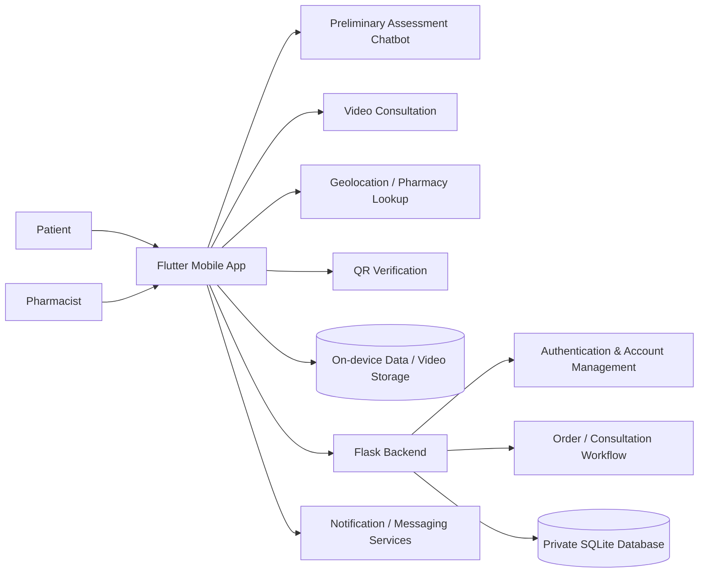

# Architecture & System Design

## Overview

The Telepharmacy PoC separated the user-facing mobile experience from server-side account and workflow logic.



## Mobile layer

The mobile client was built in Flutter so the same application codebase could target both Android and iOS.

The client handled the main user journey and integrated with device and third-party capabilities including:

- local registration data;
- chatbot interaction;
- video consultation;
- device location;
- QR-code generation;
- notifications;
- local consultation-video storage.

## Backend layer

A Python/Flask backend provided server-side support for account and workflow operations.

The backend included functionality for:

- user registration;
- patient/pharmacist login;
- pharmacist verification;
- pharmacist room lookup;
- order retrieval;
- order creation;
- password updates;
- account deactivation.

A private SQLite database was used in the prototype for account, pharmacist, and order records.

## Data model

At a high level, the backend stored three main types of records:

```text
Account
├── username
├── password hash
├── account type
├── pharmacist reference
└── status

Pharmacist
├── pharmacist ID
├── name
├── email
├── consultation room ID
└── verification value

Order
├── username
├── order ID
├── symptoms
├── expiry date
└── issue date
```

## Integration choices

The Flutter project used libraries/services for:

- **Dialogflow** — preliminary-assessment chatbot integration
- **Jitsi Meet** — video consultation
- **Firebase** — messaging/notification integration
- **Geolocator / Geocoding** — location-related functionality
- **QR Flutter** — QR-code generation
- **SQLite / Shared Preferences** — local device-side persistence

## Prototype constraints

This architecture reflects a research prototype from 2021–2022.

A production healthcare deployment would require substantially more work around areas such as:

- identity and authorization;
- encryption and key management;
- secure API design;
- auditability;
- healthcare-data governance;
- resilience and monitoring;
- production-grade cloud infrastructure.

Those areas are intentionally outside the scope of this public case study.